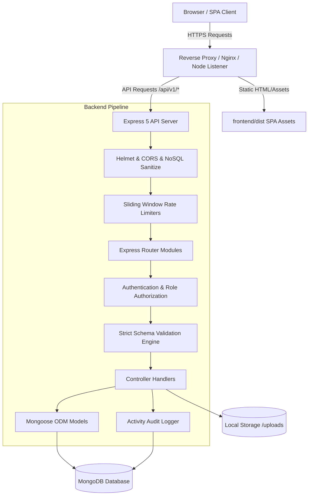
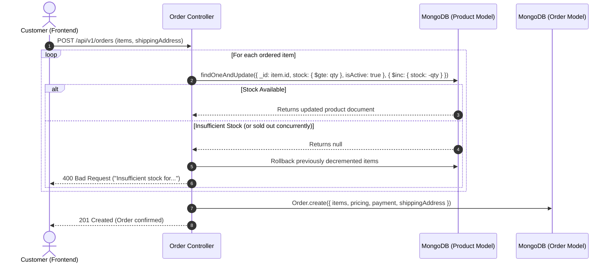

# Architecture & Design Patterns

**Application:** EzzyShop Fullstack MERN E-Commerce  
**Design Paradigm:** Layered Service Architecture (Backend) + Component-Store Reactive Architecture (Frontend)

---

## 1. High-Level Architectural Overview

EzzyShop is designed as a decoupled fullstack MERN system within a monorepo workspace. The frontend is a React 19 Single Page Application built with Vite and Tailwind CSS. The backend is an Express 5 REST API utilizing Mongoose for MongoDB data modeling.



---

## 2. Backend Layered Architecture

The backend codebase (`/backend/src`) adheres strictly to a clean separation of concerns:

```
Request 
  ──> Global Middleware (Helmet, CORS, Body Parsers, MongoSanitize)
    ──> Route Definition (`routes/*.routes.js`)
      ──> Rate Limiting (`rateLimiter.middleware.js`)
        ──> Authentication & Authorization (`auth.middleware.js`, `role.middleware.js`)
          ──> Schema Validation (`validate.middleware.js` + `validators/*.validator.js`)
            ──> Controller Logic (`controllers/*.controller.js`)
              ──> Model Layer (`models/*.js`)
                ──> Database Execution
                  ──> Response Envelope (`ApiResponse.js`)
```

### 2.1 The Layers Explained

1. **Routing Layer (`src/routes/`):**
   - Maps HTTP methods and URI paths to their designated controllers.
   - Attaches route-specific middleware chains (rate limiters, token decoders, permission gates, payload validators).
2. **Middleware Layer (`src/middleware/`):**
   - `auth.middleware.js`: Extracts and decodes JWT Bearer tokens, populating `req.user`.
   - `role.middleware.js`: Enforces role-based gates (`adminOnly`, `masterOnly`, `adminOrMaster`, `forbidMasterCatalogModification`).
   - `validate.middleware.js`: Executes custom zero-dependency schema validations against `req.body`, `req.query`, or `req.params`.
   - `sanitize.middleware.js`: Recursively strips dangerous NoSQL injection characters (`$` and `.`) from request payloads.
   - `rateLimiter.middleware.js`: Implements dual IP and account-based rate limiting with exponential backoff on authentication paths.
   - `error.middleware.js`: Intercepts unhandled exceptions or rejected promises, formats errors safely, masks internal stack traces in production, and standardizes HTTP error payloads.
3. **Controller Layer (`src/controllers/`):**
   - Houses business logic, orchestrates data validation, calculates monetary amounts, and coordinates transactions.
   - Wrapped inside `asyncHandler` to safely pass errors into the centralized error handler without boilerplate try/catch blocks.
4. **Model Layer (`src/models/`):**
   - Encapsulates schema definitions, validation rules, default values, pre-save hooks (e.g. slug generation), and indexing.
   - Includes custom document methods like `User.prototype.comparePassword`.
5. **Utility Layer (`src/utils/`):**
   - `ApiError.js`: Standardized operational error class with status codes.
   - `ApiResponse.js`: Standardized success payload builder.
   - `activityLogger.js`: Non-blocking administrator audit log recorder.
   - `logger.js`: Console logging with timestamps and environment awareness.

---

## 3. Frontend Component & State Architecture

### 3.1 Routing & Guard Hierarchy

The frontend uses React Router v7 (`frontend/src/routes/AppRoutes.jsx`) with a nested layout and guard architecture:

```
<Routes>
  ├── <MainLayout> (Public Storefront Header + Mobile Nav + Footer)
  │     ├── / (Home)
  │     ├── /products (Catalog & Filters)
  │     ├── /products/:id (Product Details)
  │     ├── /login, /register (Auth Pages)
  │     └── <ProtectedRoute> (Requires active user session)
  │           ├── /profile
  │           ├── /cart
  │           ├── /addresses
  │           ├── /checkout
  │           ├── /orders & /orders/:id
  ├── /master/login (Standalone Master login)
  ├── <MasterRoute> (Requires role: "master")
  │     └── /master/admins (Admin management & activity audit logs)
  └── <AdminRoute> (Requires role: "admin")
        └── <AdminLayout> (Admin Sidebar + Header + Order Notification Bell)
              ├── /admin (Dashboard)
              ├── /admin/products (Catalog CRUD)
              ├── /admin/categories (Category CRUD)
              └── /admin/orders (Order Status Fulfillment)
```

### 3.2 State Management Pattern (Zustand)

Rather than maintaining a massive monolithic Redux store, state is split into specialized, self-contained Zustand stores:

- **`auth.store.js`:**
  - Manages `user`, `token`, `isAuthenticated`, `isLoading`, and `isInitialized`.
  - Performs session restoration on initial mount via `sessionStorage`.
  - Handles login, registration, and logout cleanup.
- **`cart.store.js`:**
  - Manages active cart items, item counts, and subtotal computations.
  - Synchronizes with `/api/v1/cart` endpoints.
- **`adminNotification.store.js`:**
  - Powers real-time operational alerts for admin users.
  - Detects new unfulfilled orders, updates badges, and plays synthesized audio alerts via HTML5 Audio API.
- **`ui.store.js`:**
  - Controls transient UI state such as responsive sidebar drawers and mobile navigation toggles.

---

## 4. Concurrency, Race Condition & Inventory Control

To eliminate inventory overselling during high-concurrency checkouts, EzzyShop implements atomic conditional reservations directly within the MongoDB database engine:



If an order is cancelled later by a customer or admin, the reserved quantities are restored using atomic `$inc: { stock: item.quantity }` updates.

---

## 5. Security & Governance Architecture

### 5.1 Three-Tier Role Segregation

```
┌─────────────────────────────────────────────────────────────┐
│                       Master Admin                          │
│  - System governance & admin provisioning                   │
│  - Audit log monitoring across all actions                  │
│  - CANNOT alter products, inventory, or pricing             │
└──────────────────────────────┬──────────────────────────────┘
                               │ provisions
                               ▼
┌─────────────────────────────────────────────────────────────┐
│                     Operational Admin                       │
│  - Product catalog CRUD & media uploads                     │
│  - Category management                                      │
│  - Customer order fulfillment & status updating             │
│  - Actions are permanently audited into ActivityLog         │
└──────────────────────────────┬──────────────────────────────┘
                               │ fulfills orders for
                               ▼
┌─────────────────────────────────────────────────────────────┐
│                     Storefront Customer                     │
│  - Browses public catalog & active categories               │
│  - Modifies personal cart & saved addresses                 │
│  - Places orders & cancels pending orders                   │
└─────────────────────────────────────────────────────────────┘
```

### 5.2 Defense-in-Depth Security Matrix

1. **HTTP Layer:** Strict CSP, no-sniff, clickjacking frameguard (`helmet`).
2. **Transport & Origin:** CORS whitelist restricting external origins.
3. **Payload Inspection:** 1 MB JSON payload caps protecting against memory exhaustion attacks.
4. **Input Sanitization:** Recursive parameter inspection stripping NoSQL query injection operators (`$gt`, `$where`, etc.).
5. **Strict Schema Engine:** Zero-trust payload parser rejecting disallowed fields (`allowUnknown: false`), stopping mass-assignment privilege escalation.
6. **Rate Limiting:** Sliding-window rate limiters with exponential backoff on auth endpoints.
7. **File Execution Quarantine:** Media uploads assigned random hashes and served statically with restrictive `Content-Security-Policy: sandbox; default-src 'none'`.
